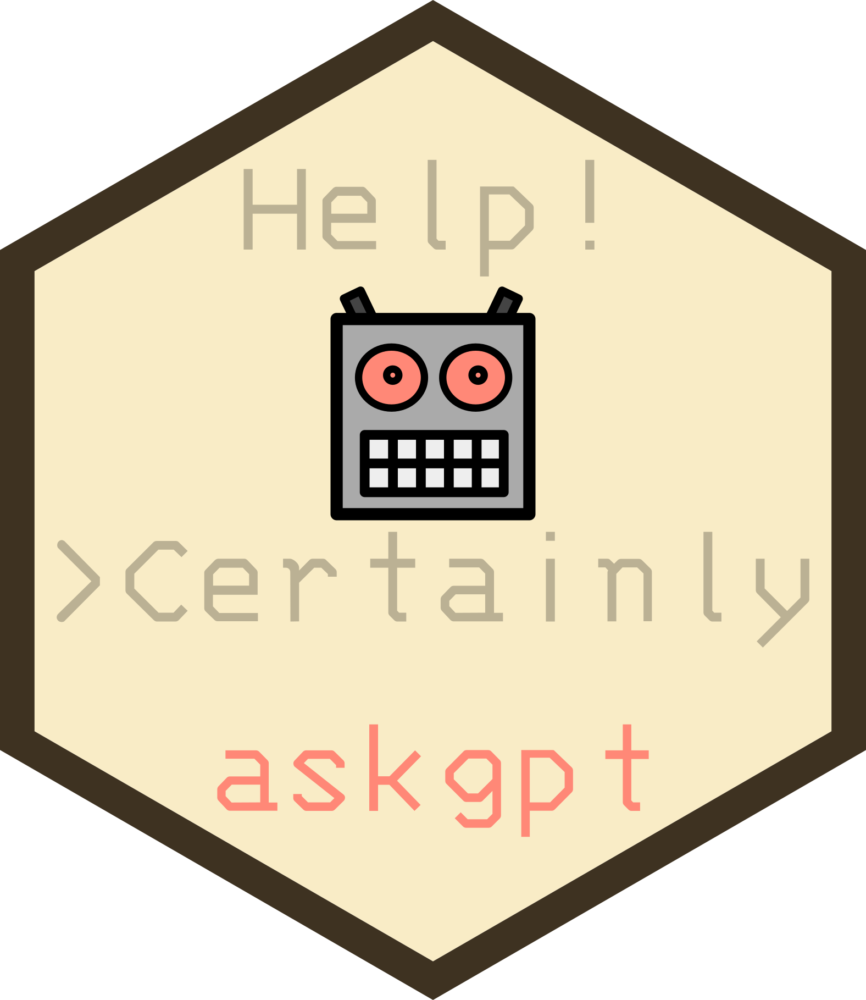

<!-- README.md is generated from README.Rmd. Please edit that file -->

```{r, include = FALSE}
knitr::opts_chunk$set(
  collapse = TRUE,
  comment = "#>",
  fig.path = "man/figures/README-",
  out.width = "100%"
)
```

# askgpt 

<!-- badges: start -->
[](https://lifecycle.r-lib.org/articles/stages.html#stable)
[](https://github.com/JBGruber/askgpt/actions/workflows/R-CMD-check.yaml)
[](https://app.codecov.io/gh/JBGruber/askgpt?branch=main)
[](https://CRAN.R-project.org/package=askgpt)
[](https://cran.r-project.org/package=askgpt)
<!-- badges: end -->

You're new to R?
You don't quite understand the code you copied from that tutorial?
You get error messages that make no sense to you?
Don't worry, just *askgpt*!

`askgpt` is basically ChatGPT but from R (technically, it sends prompts to [OpenAI's API](https://openai.com/api/) directly from R).
It also has some additional functionality:

- Prompt *"What is wrong with my last command?"* (or *"help!"*) to get help on the last error R emitted
- Use the RStudio addin to comment, annotate or explain highlighted code

See more under [Usage](#usage).

## Installation

You can install release version of askgpt like so:

``` r
install.packages("askgpt")
```

You can install the development version of askgpt like so:

``` r
remotes::install_github("JBGruber/askgpt")
```

```{r echo=FALSE, results='asis'}
fig_path = "vignettes/figs"
res <- knitr::knit_child("vignettes/Usage.Rmd", quiet = TRUE)
cat(res, sep = '\n')
```

