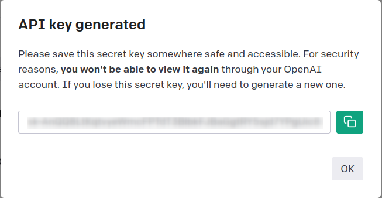
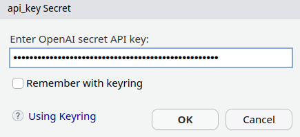

<!-- README.md is generated from README.Rmd. Please edit that file -->

# askgpt

<!-- badges: start -->

[](https://lifecycle.r-lib.org/articles/stages.html#experimental)
[](https://github.com/JBGruber/askgpt/actions/workflows/R-CMD-check.yaml)
[](https://app.codecov.io/gh/JBGruber/askgpt?branch=main)
[](https://CRAN.R-project.org/package=askgpt)
<!-- badges: end -->

You’re new to R? You don’t quite understand the code you copied from
that tutorial? You get error messages that make no sense to you? Don’t
worry, just *askgpt*!

`askgpt` is basically ChatGPT but from R (technically, it sends prompts
to [OpenAI’s API](https://openai.com/api/) directly from R). It also has
some additional functionality:

- Prompt *“What is wrong with my last command?”* (or *“help!”*) to get
  help on the last error R emitted
- Use the RStudio addin to comment, annotate or explain highlighted code

See more under [Usage](#usage).

## Installation

You can install release version of askgpt like so:

``` r
install.packages("askgpt")
```

You can install the development version of askgpt like so:

``` r
remotes::install_github("JBGruber/askgpt")
```

## Log In

You can log into OpenAI’s API running the dedicated `login()` function
or just ask something with `askgpt()`:

``` r
library(askgpt)
login()
#> ℹ It looks like you have not provided an API key yet. Let me guide you through the process:
#>   1. Go to <https://platform.openai.com/account/api-keys>
#>   2. (Log into your account if you haven't done so yet)
#>   3. On the site, click the button + Create new secret key
#>   to create an API key
#>   4. Copy this key into R/RStudio
```

<div class="figure">


<p class="caption">
Copy the API key from OpenAI’s website
</p>

</div>

<div class="figure">


<p class="caption">
And paste it into RStudio
</p>

</div>

You will not need to do this again after the first time. (Technical
detail: This will store an encrypted version of your key in the
directory returned by `rappdirs::user_cache_dir("askgpt")`.) If your old
API key does not work any more, you can store a new one with:
`login(force_refresh = TRUE)`.

## Usage

To enable error logging (which you need if you want askgpt to explain
errors to you) first run:

``` r
log_init()
```

After this, the key phrase **“What is wrong with my last command?”** (or
just “help!”) will make `askgpt` look up your last command and error
message and return some help for you. The other important key phrase is
**“Can you elaborate on that?”** (or just “What?”), which will elaborate
on the previous answer. You can ask basically any question you want
though:

<figure>
<video
src="https://user-images.githubusercontent.com/23524101/220632749-da59fe90-d6a2-4ebd-bbfe-d1164e8a7944.mp4"
controls=""><a
href="https://user-images.githubusercontent.com/23524101/220632749-da59fe90-d6a2-4ebd-bbfe-d1164e8a7944.mp4">some
examples</a></video>
<figcaption aria-hidden="true">some examples</figcaption>
</figure>

## Configure

You can configure how `askgpt` makes that start with `askgpt_*`. For
example, to use a different model to use in `askgpt()` use
`options(askgpt_chat_model = "gpt-3.5-turbo-0301")`. If you use the
completions instead of the chat API (`chat = FALSE` in `askgpt()`) use
`options(askgpt_completions_model = "text-curie-001")`. It does not
matter if the API parameter is listed in the function or not. All are
used. See the complete list
[here](https://platform.openai.com/docs/api-reference/chat) and
[here](https://platform.openai.com/docs/api-reference/completions)

The most important setting, however, is `askgpt_config`. This can be
used to configure the chat using plain English:

``` r
options(askgpt_config = "I'm 8 years old, please explain things easily")
askgpt("What is an R function?")
#> 
#> ── Answer ──────────────────────────────────────────────────────────────────────
#> An R function is like giving your friend a set of instructions to perform a
#> particular task. In R programming, a function is a set of instructions or steps
#> that is given a name, and when you call that name, the function will perform
#> those instructions. A function can take information or inputs, do something
#> with those inputs (like adding or subtracting), and then give the result back
#> as output.
#> 
#> For example, think about giving your friend the instructions to make a peanut
#> butter sandwich. The instructions might be:
#> 
#> 1. Take two slices of bread 2. Spread peanut butter on one slice 3. Spread
#> jelly on the other slice 4. Put the two slices together
#> 
#> In R, a function might take a number (like 5) and add 1 to it, and then return
#> the result (which would be 6).
#> 
#> Functions in R are used to make code easier to use, understand, and reuse. They
#> can also help programmers write complex and efficient programs.
```
