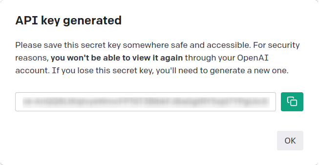

<!-- README.md is generated from README.Rmd. Please edit that file -->

# askgpt

<!-- badges: start -->

[](https://lifecycle.r-lib.org/articles/stages.html#experimental)
<!-- badges: end -->

The goal of askgpt is to help you to learn R, using a ChatGPT-like
prompt and answer system. It sends prompts to [openai’s
API](https://openai.com/api/) directly from R. It also has some
additional functionality:

- Prompt “What is wrong with my last command?” (or “help!”) to get help
  on the last error R emmitted
- Prompt “Can you elaborate on that?” (or “what?”) to ask GPT to
  elaborate on the last reply
- Use the RStudio addin to comment, annotate or explain highlighted code

See more under [Usage](#usage).

## Installation

You can install the development version of askgpt like so:

``` r
remotes::install_github("JBGruber/askgpt")
```

## Log In

You can log into OpenAI’s API running the dedicated `login()` function
or just ask something with `askgpt()`:

``` r
library(askgpt)
login()
#> ℹ It looks like you have not provided an API key yet. Let me guide you through the process:
#>   1. Go to <https://platform.openai.com/account/api-keys>
#>   2. (Log into your account if you haven't done so yet)
#>   3. On the site, click the button + Create new secret key
#>   to create an API key
#>   4. Copy this key into R/RStudio
```

<div class="figure">


<p class="caption">
Copy the API key from OpenAI’s website
</p>

</div>

<div class="figure">


<p class="caption">
And paste it into RStudio
</p>

</div>

You will not need to do this again after the first time. (Technical
detail: This will store an encrypted version of your key in the
directory returned by `rappdirs::user_cache_dir("askgpt")`.) If your old
API key does not work any more, you can store a new one with:
`login(force_refresh = TRUE)`.

## Usage

To enable error logging (which you need if you want askgpt to explain
errors to you) first run:

``` r
log_init()
```

After this, the key phrase **“What is wrong with my last command?”** (or
just “help!”) will make `askgpt` look up your last command and error
message and return some help for you. The other important key phrase is
**“Can you elaborate on that?”** (or just “What?”), which will elaborate
on the previous answer. You can ask basically any question you want
though:

<figure>
<video
src="https://user-images.githubusercontent.com/23524101/220632749-da59fe90-d6a2-4ebd-bbfe-d1164e8a7944.mp4"
controls=""><a
href="https://user-images.githubusercontent.com/23524101/220632749-da59fe90-d6a2-4ebd-bbfe-d1164e8a7944.mp4">some
examples</a></video>
<figcaption aria-hidden="true">some examples</figcaption>
</figure>
